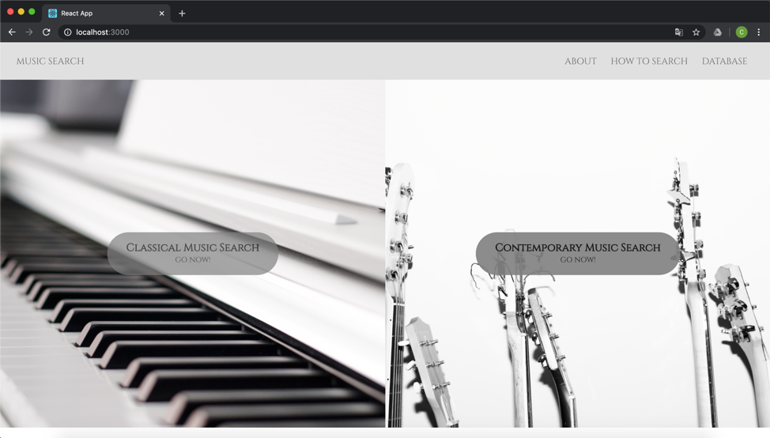
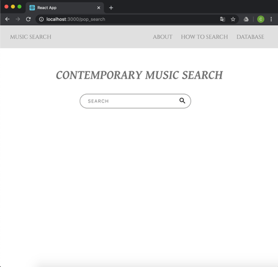
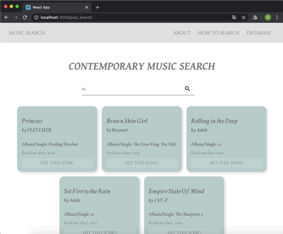
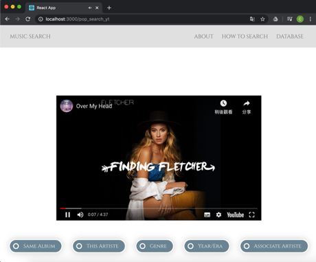
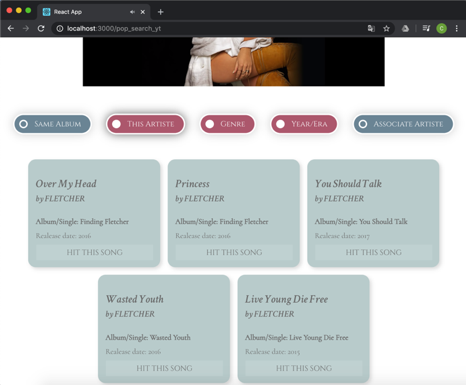

# music_search
* music_search frontend using ReactJS App: on http://localhost:3000/

## Set up
- Run the following commands to download the repo and install dependencies:

    ```
    $ git clone https://github.com/Stephanie1226/music_search.git
    $ cd music_search
    $ npm install
    $ npm start
    ```
## How to
1. Simply click on a type (contemporary/classic) of music you are interested in from the homepage

2. Search for your favorite song
 
3. Your foavorite song will pop out right away

4. Click on the checkboxes below to see related recommendations 

